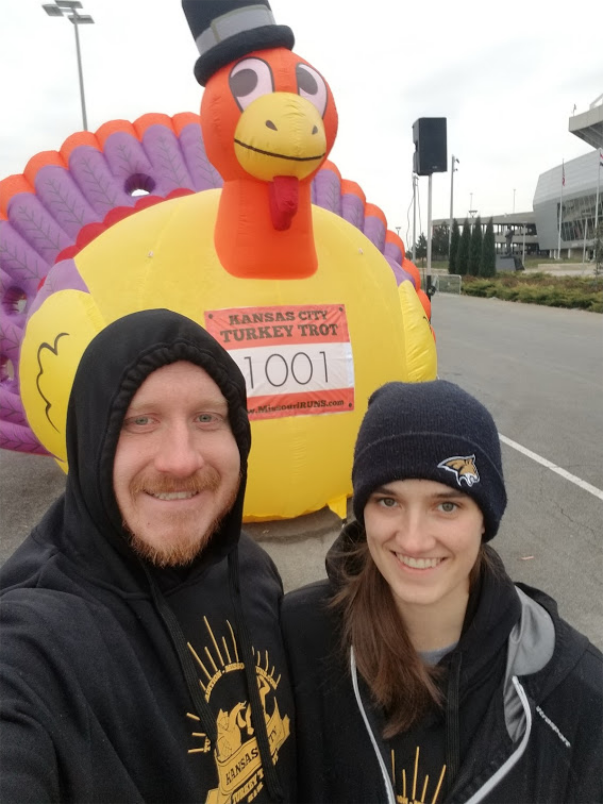
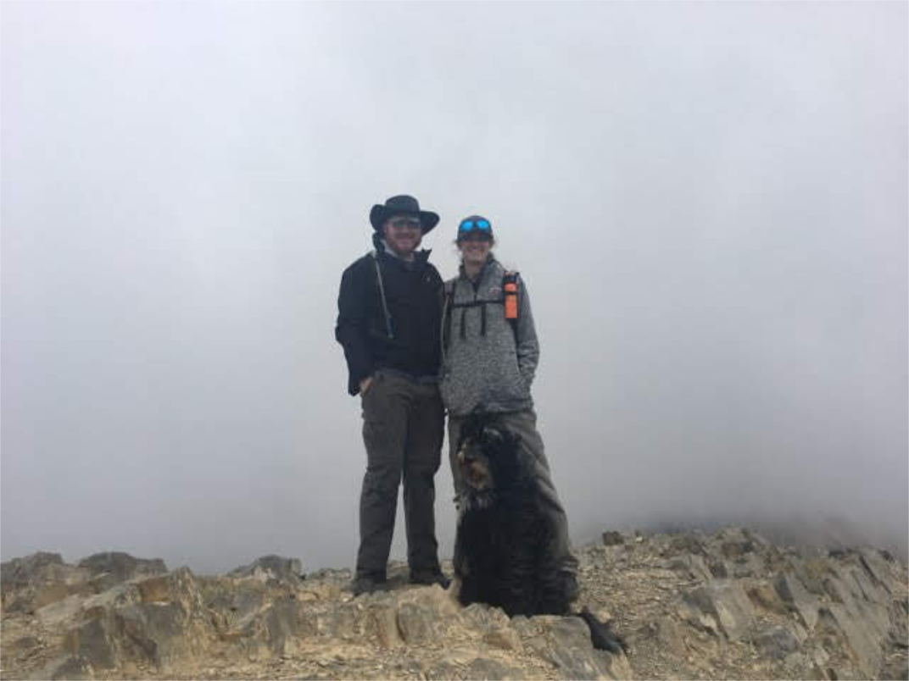
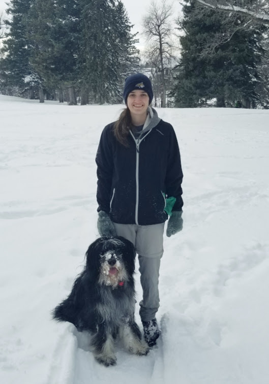

I am currently a Postdoctoral Researcher at Montana State Univerisity. Right now I'm studying <a href = "https://en.wikipedia.org/wiki/Terrestrial_gamma-ray_flash">Terrestrial Gamma-Ray Flashes (TGFs)</a> and their associated lightning. So far my research has been focused on the relationships between TGF production and lightning and thunderstorm characteristics. I am also involved in a TGF detecting project called the Light and Fast TGF Recorder (LAFTR). See more details about my research projects <a href = "https://reyannlarkey.github.io/research/">here</a>. 

## Personal
I like getting outdoors and doing activities with my Husband Jake and dogs Chief and Moose. We like to go hiking, camping, and running in the areas surrounding Bozeman. We also spend a lot of time in Kansas City, MO and Colorado visiting family. 

      
    
    

<!--
## Current Projects

### LAFTR
Montana State University (MSU) in collaboration with the University of California, Santa Cruz (UCSC) has developed the Light and Fast TGF Recorder (LAFTR), a NASA-University Student Instrumentation Project, capable of detecting high energy gamma rays at an extremely fast rate. LAFTR is light enough (less than 2.5 kg) to be deployed for balloon born observations inside thunderstorms, and fast enough to record unsaturated observations near TGF generation regions. In addition to balloon flights, the low-cost nature of LAFTR allows for many units to be deployed via ground for multi-point measurements and arrays of ground and tower-based TGF observations. 
-->
 
