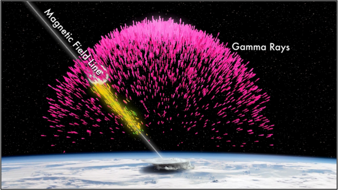

I am currently a Graduate Student at Montana State Univerisity. Right now I'm studying Terrestrial Gamma-Ray Flashes (TGFs) and their associated lightning. So far my research has been focused on the intervals between lightning flashes in TGF producing thunderstorms.  

## Current Projects

Still working on this section :) 
