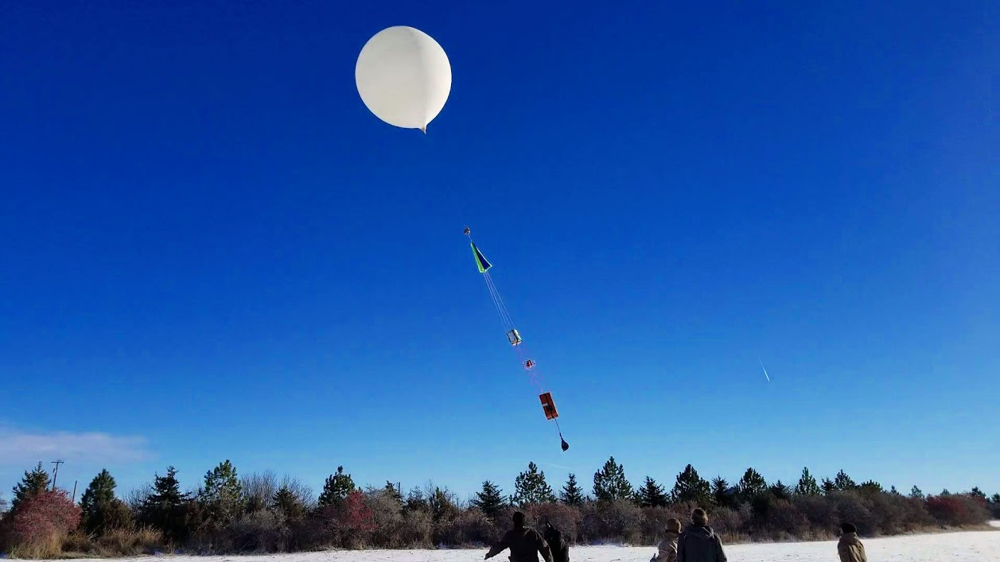
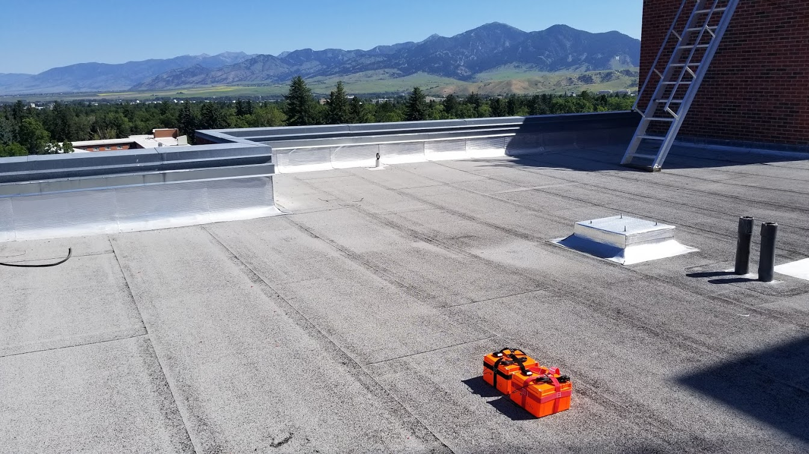

          

Montana State University (MSU) in collaboration with the University of California, Santa Cruz (UCSC) has developed the Light and Fast TGF Recorder (LAFTR), a NASA-University Student Instrumentation Project, capable of detecting high energy gamma rays at an extremely fast rate. LAFTR is light enough (less than 2.5 kg) to be deployed for balloon born observations inside thunderstorms, and fast enough to record unsaturated observations near TGF generation regions. In addition to balloon flights, the low-cost nature of LAFTR allows for many units to be deployed via ground for multi-point measurements and arrays of ground and tower-based TGF observations.

      
 
    
    

##### LAFTR Deployment Map

<iframe src="../files/m_2.html" name="LAFTR map" height="400" width="600">You need a Frames Capable browser to view this content.</iframe>  

<!--

  

    
  

  

    
  

  

    
  

-->
<!--

### Test Interactive Plot
<iframe src="../files/flowers.html"
    sandbox="allow-same-origin allow-scripts"
    width="100%"
    height="600"
    scrolling="yes"
    seamless="seamless"
    frameborder="0">
</iframe>

## Research Interests

-->
