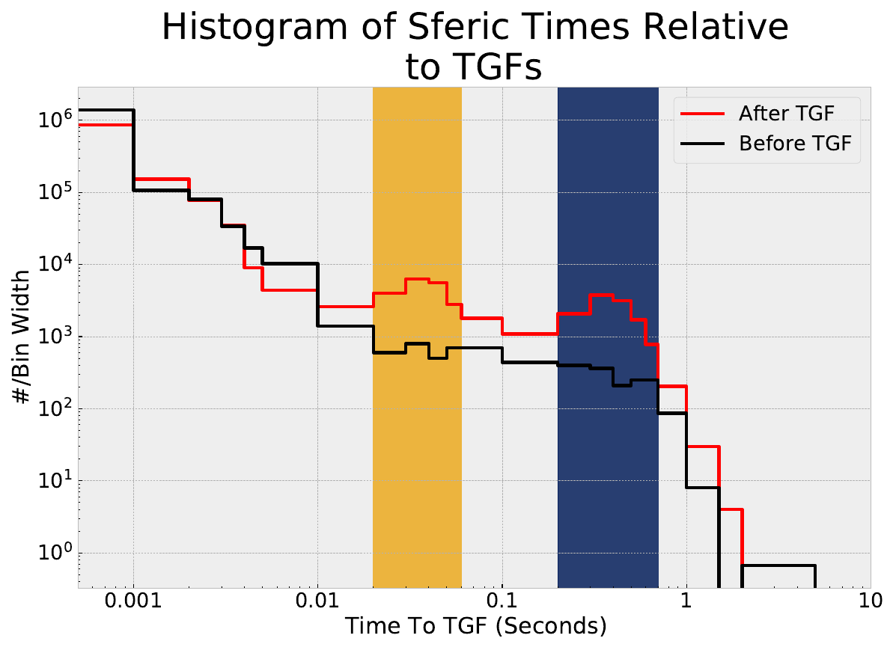
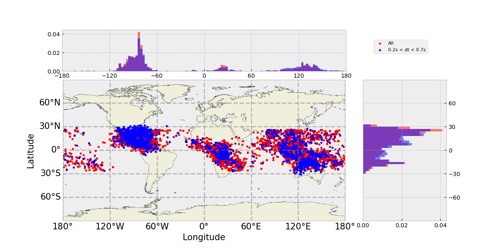
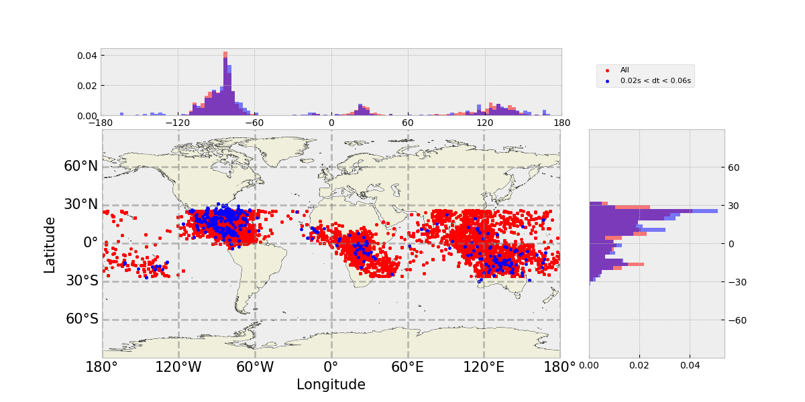

AGU 2021 Poster Supplementary Materials 

# An Examination of Prompt and Delayed Lightning Sferics Associated with TGFs

We provide an analysis of the prompt and delayed radio atmospheric signals (“sferics”) associated with a subset of TGFs. Data from Fermi GBM detected TGFs along with lightning location data from the World Wide Lightning Location Network (WWLLN) and the Earth Networks Total Lightning Network (ENTLN) are used to examine the properties of lightning flashes and TGFs that produce both “prompt” sferics (less than 10ms time difference) in relation to the TGF as well as “delayed” sferics (300-500ms time difference). Further information regarding the sferic radio low-frequency signals is provided by Duke university sensors. 

## Characteristics of the sferics and TGFs are listed below

### Sample Statistics

| Characteristic |      Value      |
|:--------------:|:---------------:|
|   Sample Size  | 1663 TGF Events |
|   Time Range   |    2010-2016    |

### Main Result
  
<em>This image shows the distribution of time delays between the lightning sferics associated with TGFs in our sample and the TGF observations themselves. </em>

### Global Distribution
  
<em>This image shows the distribution of the sferics that make up the excess spanning from 200-700ms after the TGF,
versus the sferics that make up the full dataset.</em>

  
<em>This image shows the distribution of the sferics that make up the excess spanning from 20-60ms after the TGF,
versus the sferics that make up the full dataset.</em>

No significant differences in the global distributions of these events are readily apparent. 

